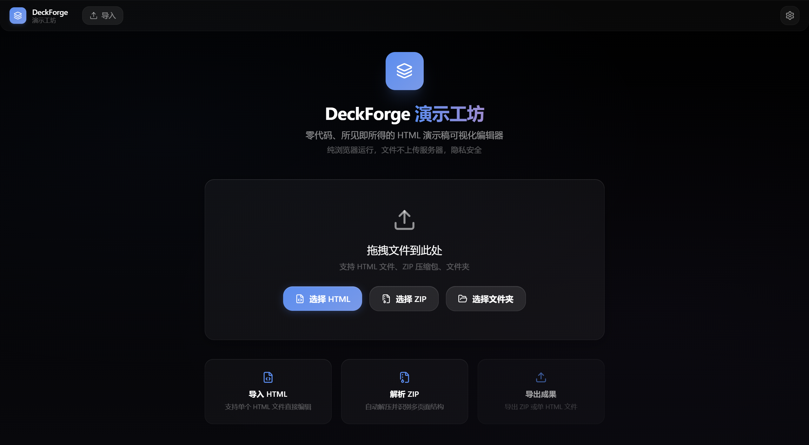
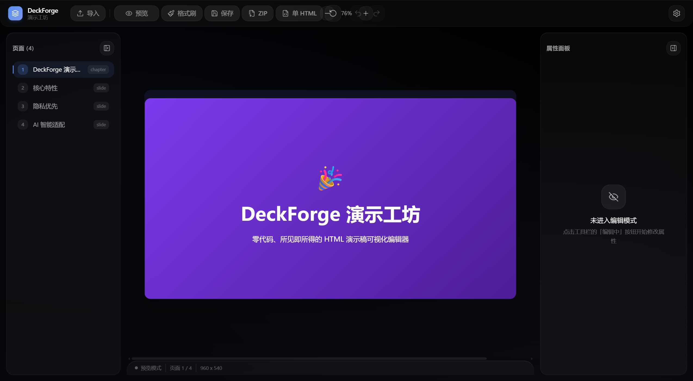

<div align="center">
  
  <h1>DeckForge</h1>
  <p><strong>Zero-backend visual editor for HTML presentations</strong></p>
  <p>Edit AI-generated HTML slides like PowerPoint. Runs entirely in the browser.</p>

  <p>
    <a href="./LICENSE"></a>
    <a href="https://react.dev"></a>
    <a href="https://vitejs.dev"></a>
    <a href="https://www.typescriptlang.org"></a>
    <a href="https://tailwindcss.com"></a>
  </p>
</div>

---

## Table of Contents

- [Overview](#overview)
- [Features](#features)
- [Demo](#demo)
- [Quick Start](#quick-start)
- [Usage](#usage)
- [Keyboard Shortcuts](#keyboard-shortcuts)
- [Tech Stack](#tech-stack)
- [Project Structure](#project-structure)
- [Browser Support](#browser-support)
- [Deployment](#deployment)
- [Roadmap](#roadmap)
- [Contributing](#contributing)
- [License](#license)

---

## Overview

DeckForge turns static HTML presentations into editable decks. Instead of editing markup by hand, you interact with slides visually: select elements, edit text, tweak styles, replace images, and export the result.

The application is built as a single-page React app that runs entirely in the browser. Local files are parsed locally with JSZip and the File System Access API. The optional GitHub repository workflow talks directly to the GitHub API and does not use a DeckForge backend.

### Why DeckForge?

Modern AI tools generate high-quality HTML slides, but making small edits afterwards is painful. DeckForge bridges that gap by providing a visual layer on top of existing HTML decks, preserving the original design while enabling fast, local edits.

---

## Features

| Feature | Description |
| --- | --- |
| **Visual Editing** | Click to select, double-click to edit text, adjust styles from the right panel. |
| **Multi-format Import** | Drag and drop single HTML files, ZIP archives, or entire folders. |
| **Slide Detection** | Automatically recognizes reveal.js, impress.js, fullpage.js, swiper, and native `.slide` / `.page` / `section` structures. |
| **Format Painter** | Copy styles from one element and apply them to others, with single-shot and continuous modes. |
| **Image Replacement** | Replace images inside the presentation without touching the markup. |
| **Flexible Export** | Commit back to the same GitHub path, export a ZIP bundle, or merge everything into a single HTML file. |
| **Undo / Redo** | Full history stack for style and content changes. |
| **Privacy First** | Local imports stay in the browser; repository saves go directly to the GitHub API. |
| **Versioned Save** | Open HTML decks from a bound GitHub repository, save to the original path, and create a commit automatically. |

---

## Demo

<div align="center">
  
  <br>
  <sub>Import screen with drag-and-drop support.</sub>
</div>

<div align="center">
  
  <br>
  <sub>Visual editor with four-panel Liquid Glass layout.</sub>
</div>

---

## Quick Start

### Prerequisites

- Node.js 20 or later
- npm 10 or later

### Local Development

```bash
# Clone the repository
git clone https://github.com/ShaneLiu04/deckforge.git
cd deckforge

# Install dependencies
npm install

# Start the development server
npm run dev

# Build for production
npm run build

# Preview the production build
npm run preview

# Run the linter
npm run lint
```

### Docker

```bash
# Build and run with Docker Compose
docker compose up -d

# Or build the image manually
docker build -t deckforge .
docker run -d -p 8080:80 --name deckforge deckforge
```

The Docker image serves the static build via Nginx on port `8080`. Note that browser file-system features may be limited inside the container; local development provides the full experience.

---

## Usage

### Recommended: bind a PPT repository

Use one GitHub repository (or one folder inside it) for all single-file HTML presentations:

1. Create a fine-grained GitHub token for the repository with **Metadata: Read** and **Contents: Read and write** permissions.
2. In DeckForge, click **PPT Repository** and enter `owner/repo`, an optional branch/folder, and the token.
3. Open an HTML file from the repository list.
4. Edit the deck and click **Commit Save**. DeckForge updates that same repository path and creates a Git commit such as `chore(ppt): update deck.html via DeckForge`.

The token is kept only in the current page's memory and must be entered again after a refresh. Local file/ZIP imports remain available for temporary editing and export, but cannot be committed back to an original path because a normal browser file input does not grant persistent write access.

### 1. Import a Presentation

Drag an HTML file, ZIP archive, or folder into the central drop zone. DeckForge will scan the content and generate a slide navigator on the left.

### 2. Toggle Edit Mode

Click the **Edit** button in the top bar or press `Ctrl + E`. The preview area becomes interactive.

### 3. Edit Content

- **Select an element** with a single click to view and edit its styles in the right panel.
- **Edit text** by double-clicking a text element.
- **Use Format Painter** by selecting a source element, clicking the Format Painter button, then clicking a target element. Hold `Shift` while clicking the button to keep it active across multiple targets.

### 4. Export

- **Save**: download the modified file back to disk.
- **Export ZIP**: package all assets into a ZIP archive.
- **Export Single HTML**: inline CSS, JS, and images into one self-contained file.
- **Restore**: revert all changes to the originally imported state.

---

## Keyboard Shortcuts

| Shortcut | Action |
| --- | --- |
| `Ctrl + S` | Save file |
| `Ctrl + Z` | Undo |
| `Ctrl + Shift + Z` | Redo |
| `Ctrl + E` | Toggle edit / preview mode |
| `Esc` | Clear selection or deactivate Format Painter |

---

## Tech Stack

- **Framework**: React 19
- **Language**: TypeScript 6
- **Build Tool**: Vite 8
- **Styling**: Tailwind CSS 4 with a custom Liquid Glass design system
- **State Management**: Zustand 5
- **ZIP Handling**: JSZip 3
- **Icons**: Lucide React
- **Container**: Nginx on Alpine Linux

---

## Project Structure

```
deckforge/
├── .github/workflows/        # GitHub Actions CI
├── public/                   # Static assets
├── src/
│   ├── components/
│   │   ├── importer/         # File import components
│   │   ├── layout/           # TopBar, LeftPanel, PreviewArea, RightPanel
│   │   ├── tools/            # Text, image, layout, and AI tool panels
│   │   └── ui/               # Reusable UI primitives
│   ├── store/                # Zustand global state
│   ├── types/                # TypeScript definitions
│   ├── utils/                # DOM bridge, ZIP utilities, file access helpers
│   ├── App.tsx
│   ├── index.css
│   └── main.tsx
├── Dockerfile
├── docker-compose.yml
├── index.html
├── LICENSE
├── package.json
├── postcss.config.js
├── README.md
├── tsconfig.json
└── vite.config.ts
```

---

## Browser Support

DeckForge targets modern evergreen browsers:

| Browser | Minimum Version |
| --- | --- |
| Chrome | 100+ |
| Edge | 100+ |
| Firefox | 100+ |
| Safari | 15+ |

Folder import requires the File System Access API, which is best supported in Chromium-based browsers.

---

## Deployment

### Static Hosting

After running `npm run build`, the `dist/` directory contains a fully static site. It can be deployed to any static host such as GitHub Pages, Vercel, Netlify, or Cloudflare Pages.

### Docker

The included `Dockerfile` and `docker-compose.yml` produce a production-ready Nginx image. See the [Quick Start](#quick-start) section for commands.

---

## Roadmap

- [ ] Responsive preview modes for common slide aspect ratios
- [ ] Built-in theme switcher and color palette presets
- [ ] Slide reordering and duplication
- [ ] Bulk find-and-replace across all slides
- [ ] Offline PWA support
- [ ] Plugin API for custom tool panels

---

## Contributing

Contributions are welcome. Please open an issue to discuss large changes before submitting a pull request.

### Reporting Issues

If you find a bug or have a feature request, please open an issue and include:

- A clear title and description.
- Steps to reproduce the problem, if applicable.
- Your browser and operating system versions.
- A minimal example file or screenshot when helpful.

### Submitting Pull Requests

1. Fork the repository and clone your fork.
2. Create a feature branch from `main`:
   ```bash
   git checkout -b feature/your-feature-name
   ```
3. Make your changes. Follow the existing code style and keep changes focused.
4. Ensure the project still builds and lints cleanly:
   ```bash
   npm run lint
   npm run build
   ```
5. Commit with a clear message:
   ```bash
   git commit -m "feat: add feature description"
   ```
6. Push your branch and open a pull request against `main`.

### Code Style

- TypeScript is used throughout. Prefer explicit types for public interfaces.
- Tailwind CSS utility classes are used for styling.
- Liquid Glass visual patterns should be consistent with existing components.
- Keep components small and focused on a single responsibility.

### Development Setup

```bash
npm install
npm run dev
```

The development server will start on `http://localhost:5173` by default.

### Questions

Feel free to open a discussion if you have questions that are not covered here.

---

## License

This project is licensed under the [MIT License](./LICENSE).

---

<div align="center">
  <sub>Built with React, Vite, and Tailwind CSS.</sub>
</div>
